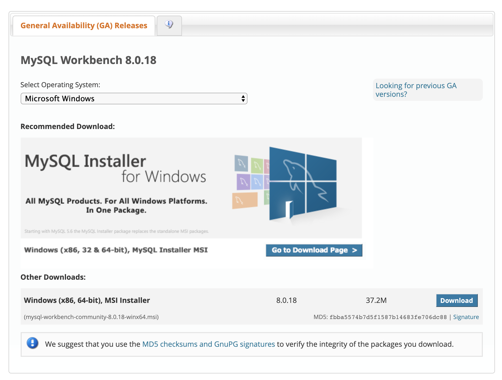

# <p style="font-family:Menlo"> Project by team: JavaDevOperation </p>
   > **<p style="font-family:Menlo">A e-Health service software application</p>**

## <p style="font-family:Menlo"> <u>**Table of Content**</u> </p>
1. <p style="font-family:Menlo"> Introduction - the project's goal </p>
2. <p style="font-family:Menlo"> Launch </p>
3. <p style="font-family:Menlo"> Screen shot of the program running </p>


## <p style="font-family:Menlo">Introduction</p> 
<p style="font-family:Menlo"> MedPort is a software application that serves as a hospital management system, designed to store and organize patient information within a secure database that allows users to easily manage the status and welfare of medical patients within any medical institution. <br>The software will have the facility to give a unique ID for search on every patient and staff and stores the details in a database.</p>


## <p style="font-family:Menlo">Launch Guide</p>

1. [Downloading and installing git repository as local instance](#installation-Setup)
    <!-- 1. [Further creating a local branch for updating](https://learngitbranching.js.org/?locale=en_US) -->
    1. [Further creating a local branch for updating](https://help.github.com/en/github/collaborating-with-issues-and-pull-requests/creating-and-deleting-branches-within-your-repository#creating-a-branch) 
2. [Downloading and installing packages/dependencies for running a java program](#java-sdk-and-tools)
3. [Downloading and installing database management tools](#data-management-and-manipulation-tools)


### <p style="font-family:Menlo">Installation Git Repo</p>
   ##### <p style="font-family:Menlo">Windows operating system</p>
   Run the following commands in PowerShell or command prompt
```cmd
1. cd ~
2. cd Documents
3. git clone https://github.com/nkforever/JavaDevOperation

```
   ##### <p style="font-family:Menlo">Macintosh operating system</p>
    Run the following commands in PowerShell or command prompt
```bash
1. cd ~
2. cd Documents
```


### <p style="font-family:Menlo">Java SDK and Tools</p>
   ##### <p style="font-family:Menlo">Windows operating system</p>
> Software to install
1. 

   ##### <p style="font-family:Menlo">Macintosh operating system</p>
> Software to install


### <p style="font-family:Menlo">Data Management and Manipulation Tools</p>
   ##### <p style="font-family:Menlo">Windows operating system</p>
> Software to install
1. MySQL Community workbench  [](https://dev.mysql.com/downloads/workbench/)
    > ***image***
    
    
2. [MySQL Database Server]() 
   ##### <p style="font-family:Menlo">Macintosh operating system</p>