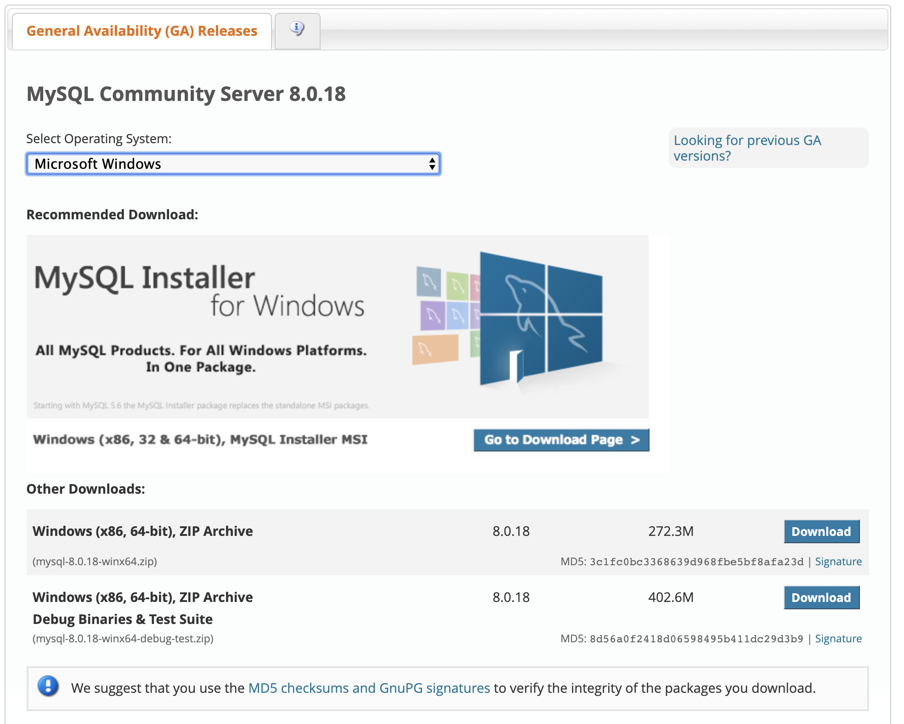

# <p style="font-family:Menlo"> Project by team: JavaDevOperation </p>
   > **<p style="font-family:Menlo">A e-Health service software application</p>**

## <p style="font-family:Menlo"> <u>**Table of Content**</u> </p>
1. <p style="font-family:Menlo"> Introduction - the project's goal </p>
2. <p style="font-family:Menlo"> Launch </p>
3. <p style="font-family:Menlo"> Screen shot of the program running </p>


## <p style="font-family:Menlo">Introduction</p> 
<p style="font-family:Menlo"> MedPort is a software application that serves as a hospital management system, designed to store and organize patient information within a secure database that allows users to easily manage the status and welfare of medical patients within any medical institution. <br>The software will have the facility to give a unique ID for search on every patient and staff and stores the details in a database.</p>


## <p style="font-family:Menlo">Launch Guide</p>

1. [Downloading and installing git repository as local instance](#installation-Setup)
    1. [Further creating a local branch for updating](https://help.github.com/en/github/collaborating-with-issues-and-pull-requests/creating-and-deleting-branches-within-your-repository#creating-a-branch) 
2. [Downloading and installing packages/dependencies for running a java program](#java-sdk-and-tools)
3. [Downloading and installing database management tools](#data-management-and-manipulation-tools)


### <p style="font-family:Menlo">Installation Git Repo</p>
   ##### <p style="font-family:Menlo">Windows operating system</p>
   ```Run the following commands in PowerShell or command prompt```
```bash
1. cd ~
2. cd Documents
3. git clone https://github.com/nkforever/JavaDevOperation

```
   ##### <p style="font-family:Menlo">Macintosh operating system</p>
   ```Run the following commands in terminal```
```bash
1. cd ~
2. cd Documents
3. git clone https://github.com/nkforever/JavaDevOperation
```


### <p style="font-family:Menlo">Java SDK and Tools</p>

**Required Software**
1. Java Development Kit (13) [](https://www.oracle.com/technetwork/java/javase/downloads/index.html)
2. Latest Eclipse [](https://www.eclipse.org/downloads/packages/release/2019-09/r/eclipse-ide-java-developers)
   ##### <p style="font-family:Menlo">Windows operating system</p>
> Steps to setting up environment
1. Open eclipse
2. Set your workspace to the Folder of JavaDevOperation.
    For example, if you git cloned in Documents then input the line below in the workspace input.
    ```Documents\JavaDevOperation```
3. In eclipse, go to File option and select Import
4. Double click on General
5. Exisiting Projects into Workspace. Then click next button
6. Under root directory select
2. Select ‘Java Project’ from the list.
3. Enter a Name for the Java Project. Click ‘Next’.
4. Under the ‘Libraries’ tab, click ‘Add Library…’ (or Under your project name, under build path,
click ‘Add Library..’)
5. Select ‘User Library’. Click ‘Next’.
6. Click on ‘User Libraries…’ Click ‘New’.
7. Enter a name for the User Library (Any name will do, for example, ‘Oracle.JDBC’). Click ‘OK’.
8. Click on ‘Add external JARs…’ Locate the ‘ojdbc6.jar’ file.
9. Click ‘OK’. Make sure that the user library that you just created is checked.
10. Click ‘Finish’.

   ##### <p style="font-family:Menlo">Macintosh operating system</p>
> 


### <p style="font-family:Menlo">Data Management and Manipulation Tools</p>
  ##### <p style="font-family:Menlo">Windows operating system</p>
> Software to install
1. MySQL Community workbench      [](https://dev.mysql.com/downloads/workbench/)
    > ***MySQL Community Workbench***
    
    
2. MySQL Database Server           [](https://dev.mysql.com/downloads/mysql/) 
    >***MySQL Database Server***
    


  ##### <p style="font-family:Menlo">Macintosh operating system</p>
> Software to install
1. MySQL Community workbench      [](https://dev.mysql.com/downloads/workbench/)
    > ***MySQL Community Workbench***
    
    
2. MySQL Database Server           [](https://dev.mysql.com/downloads/mysql/) 
    >***MySQL Database Server***
    

